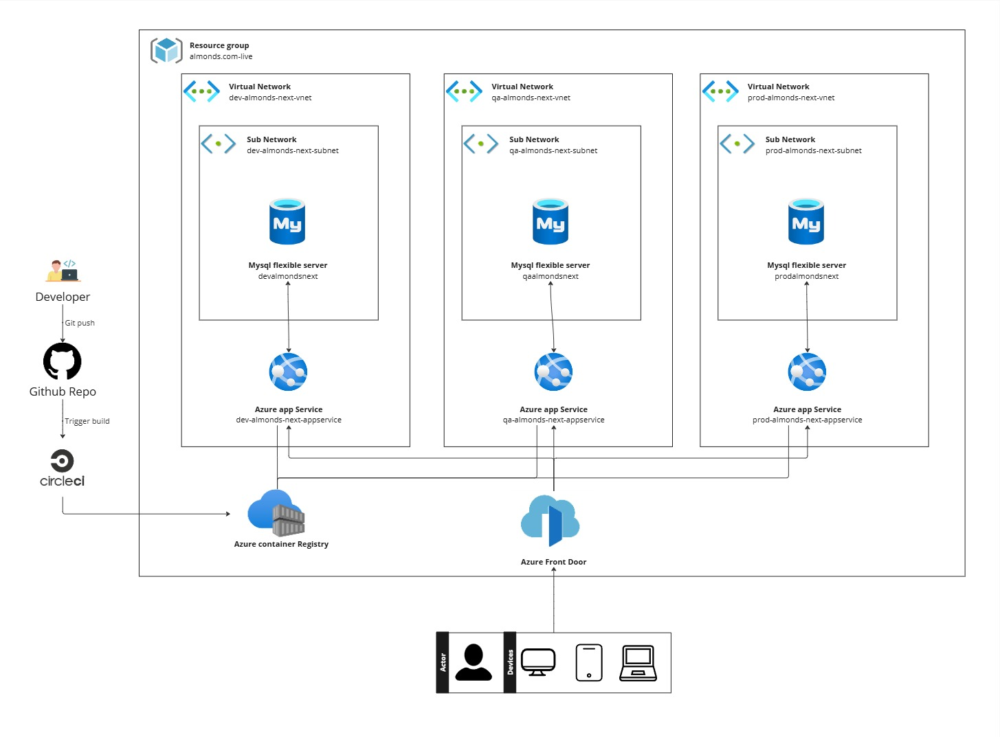

# Consulting Azure Infrastructure
## Introduction

This project is a proposal for the infrastructure that could be deployed on Azure. Terraform is used to manage the resources as well as the environments for development, QA, and production.

The following resources are considered:

- **App Service**: Used to deploy the application by leveraging a Docker image and ensuring scalability and availability.
- **MySQL Flexible Server**: A managed database service that provides high availability, automated backups, and flexible scaling options.
- **Azure Container Registry**: Used to store and manage Docker images that the project utilizes, allowing for secure and efficient image distribution.
- **Azure Front Door**: Provides global load balancing and secure, fast delivery of applications by routing traffic to the closest server and optimizing performance across regions.
- **Virtual Network**: Provides isolation and security for the resources deployed in the environment.

## Terraform

Terraform is used to manage the infrastructure as code, allowing for consistent, repeatable deployments and easy management of resources. The project is structured into modular components, where each module represents a specific resource or group of resources. These modules are reused across different environments—development, QA, and production—to ensure consistency and to streamline the deployment process.

The following modules are included:

- **appservice**: This module deploys an App Service that runs a Docker image. It is designed to provide a scalable and managed hosting environment for your containerized applications.
- **mysql**: This module deploys a MySQL Flexible Server. It offers a fully managed database service with high availability, automated backups, and scaling capabilities to meet your data storage needs.
- **network**: This module deploys a Virtual Network. It creates a secure and isolated network environment, allowing you to manage and control your network traffic effectively.